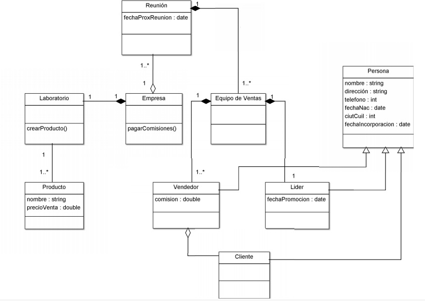

1. **AGREGACIÓN**: Tipo de asociación que comprende a las clases y a sus diferentes componentes constituyendo un todo. Es una relación que indica que una clase es parte de otra, en la que los componentes pueden ser compartidos por varios compuestos y la destrucción del compuesto no implica la destrucción de los componentes.

2. **COMPOSICIÓN**: Tipo de agregación donde cada componente constituye una parte del objeto compuesto y los componentes no pueden ser compartidos por varios objetos compuestos.
Además, la vida de los componentes coincide con la vida del objeto compuesto.  

```
Una empresa fabrica en su laboratorio diversos productos, los cuales distribuye exclusivamente a través de sus representantes de ventas.
La estructura de ventas se organiza en equipos coordinados por líderes. De cada líder se registra su nombre, dirección, teléfono, fecha de nacimiento, CUIT o CUIL, la fecha de su incorporación a la empresa y la fecha de su promoción a la categoría de líder, así como su equipo de vendedores. De cada vendedor se asienta la misma información, excepto la fecha de promoción a la categoría de líder e incorpora su comisión.
Todos los representantes de ventas, vendedores y líderes, poseen su propia cartera de clientes, de los cuales se registra el nombre, dirección, teléfono y fecha de nacimiento, así como la fecha de ingreso a la empresa en calidad de cliente.
Una vez por mes la empresa lleva a cabo una reunión general con toda su fuerza de ventas, en la cual informa la fecha de la próxima reunión, manteniendo el registro tanto de la última como de la próxima reunión, y brinda información de seguimiento de ventas. 
Entre reunión y Equipo de Ventas existe una composición, ya que si no hay un equipo de ventas no se puede realizar ninguna reunión.
Entre Laboratorio y Empresa también, ya que la empresa tiene un laboratorio para fabricar sus productos y si este no existe no se podrían fabricar productos y por lo tanto la empresa no tendría sentido.
La última composición es entre Equipo de Ventas y Vendedor y Equipo de Ventas y Líder. Esto se debe a que el equipo de ventas está conformado sí o sí por un líder y vendedores; si no fuese así no habría equipo de ventas. 

```


 


