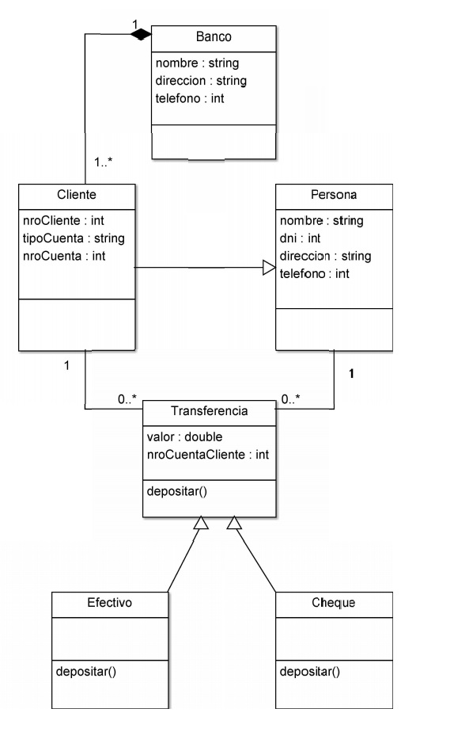

```
En un banco, una persona cualquiera puede hacer una transferencia a un cliente del mismo. Esta transferencia puede ser en efectivo o por un cheque.
La clase transferencia tiene el método depositar. Las clases heredadas por Transferencia, Efectivo y Cheque, implementan este método, pero de diferentes formas. En este banco solo se realizan depósitos de cheques por ventanilla y este movimiento tiene un recargo del 20% para depósitos de hasta $5000, 25% para depósito de entre $5000 y $10000 y el 30% para depósitos mayores de $10000, en cambio el efectivo se deposita en el cajero sin recargo alguno.
```



